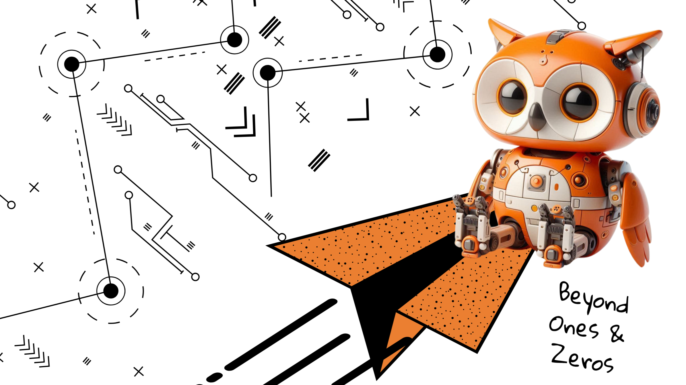

  <h3><em>“Only Ones and Zeros.”</em></h3>
  Everything begins there — infinite worlds from the simplest code.

<!-- Banner / Logo -->

  <!-- Replace with your own image file once uploaded to profile/ -->
  

# 🦉 𝙱𝚎𝚢𝚘𝚗𝚍 𝙶𝚎𝚎𝚔𝚜 & 𝚅𝚘𝚢𝚊𝚐𝚎

Welcome to our little corner of the internet.  
We’re a gathering of builders, tinkerers, and wanderers who believe technology should do more than just work. It should protect, connect, and guide us toward a better tomorrow.

This is not just a company — it’s a voyage.  
We chase curiosity, build with intention, and explore the unknown with open hands.

---

## ✨ 𝚆𝚑𝚊𝚝 𝚠𝚎 𝚍𝚘
- 🎨 **Product Design** — ideas turned into experiences people love  
- 💻 **Web / App / Software Development** — human-centered builds that work and last  
- 📣 **Media Engagement** — stories and campaigns that resonate  
- 🌱 **Experiments** — sometimes strange, sometimes useful, always alive  

---

## 📂 𝙿𝚛𝚘𝚓𝚎𝚌𝚝𝚜
<!--
Example:
- [ProjectName](https://github.com/beyondgeeks254/projectname) → one-liner about what it does.
-->

_We’re still charting this map. Projects will be added here as they take shape._

---

## 🌌 𝚃𝚑𝚎 𝚂𝚙𝚒𝚛𝚒𝚝
We are geeks, yes — but beyond that, we are travelers.  
Each repo is a step on the journey. Some are rough, some are polished, all are alive.  

You’re welcome to walk with us.
